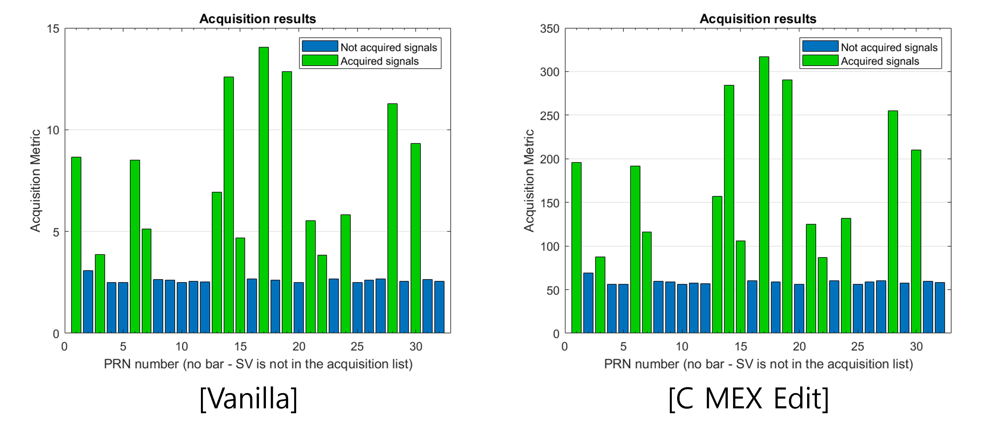
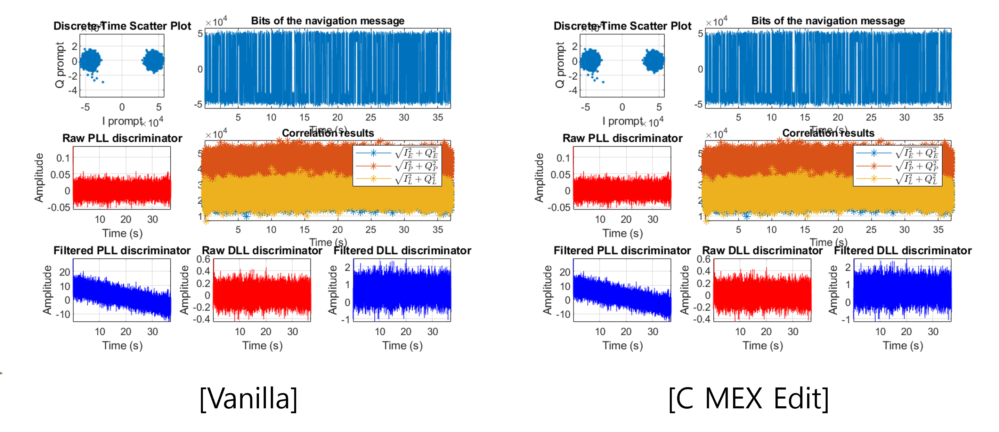
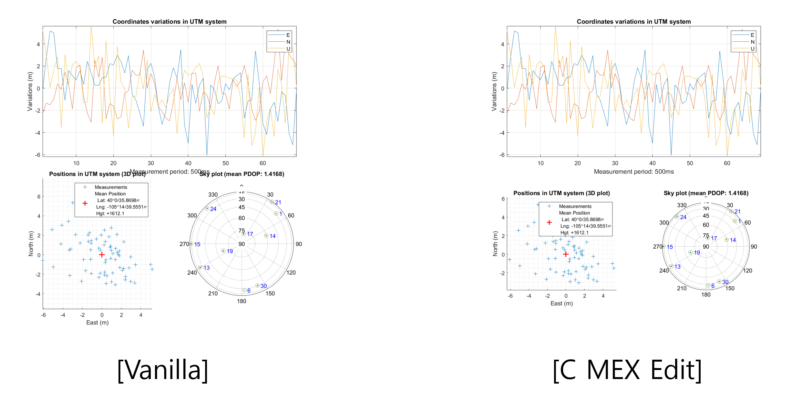

# GNSS L1C/A SDR

OS (Open Source) GNSS (Global Navigation Satellite System) L1C/A (L1 Coarse Acquisition) SDR (Software-Defined Radio) CMEX Edit

**The program code will be committed later.**

## Repository Info

OS GNSS L1C/A SDR CMEX Edit is SDR based on [OS GNSS L1C/A SDR](https://github.com/gnsscusdr/CU-SDR-Collection).

OS GNSS L1C/A SDR is configured with 5 main block, initialization, **acquisition**, **tracking**, navigation, civil processing. The project aims to accelerate acquisition and tracking block through CMEX. Table below comparing the tack time performance of the following configurations.

In acquisition, resampling and downsampling recovery is not implemented with cmex. 
In tracking, C/N0 calculation is not implemented with cmex.

||Reference (s)|CMEX (s)|Proportion (%)|
|-|-|-|-|
|Acquisition|16.296|9.916|60.849|
|Tracking|395.276|35.788|9.042|

For integrity verification, we process signal provided as [OS GNSS SDR Dataset](https://drive.google.com/drive/folders/1UkjJwOMlKEFZiXYUdK4HKzTASYHXMsHL)

The acquisition plot of vanilla and c-mex SDRs are as follows:



The tracking plot for PRN 17 of vanilla and c-mex SDRs are as follows:



As a result, navigation for vanilla SDR and c mex SDR is equal as follow:




## Development Environment
### Software
- MATLAB 2024a
- C(MATLAB CMEX)

### Hardware

- MATLAB Benchmark Result


## CMEX build

- [cmex_acquisition.c](./mex/acquisition_cmex.c)
  - acquisition based on CMEX
  - build
    ```console
     mex -v -I'./mex' -lfftw3 './mex/acquisition_cmex.c' -L'./mex' libfftw3.lib -outdir './mex' COMPFLAGS="/openmp $COMPFLAGS"
    ```
- [tracking_cmex.c](./mex/tracking_cmex.c)
  - tracking based on CMEX
  - build
    ```console
    mex -v './mex/tracking_cmex.c' -outdir './mex'
    ```
